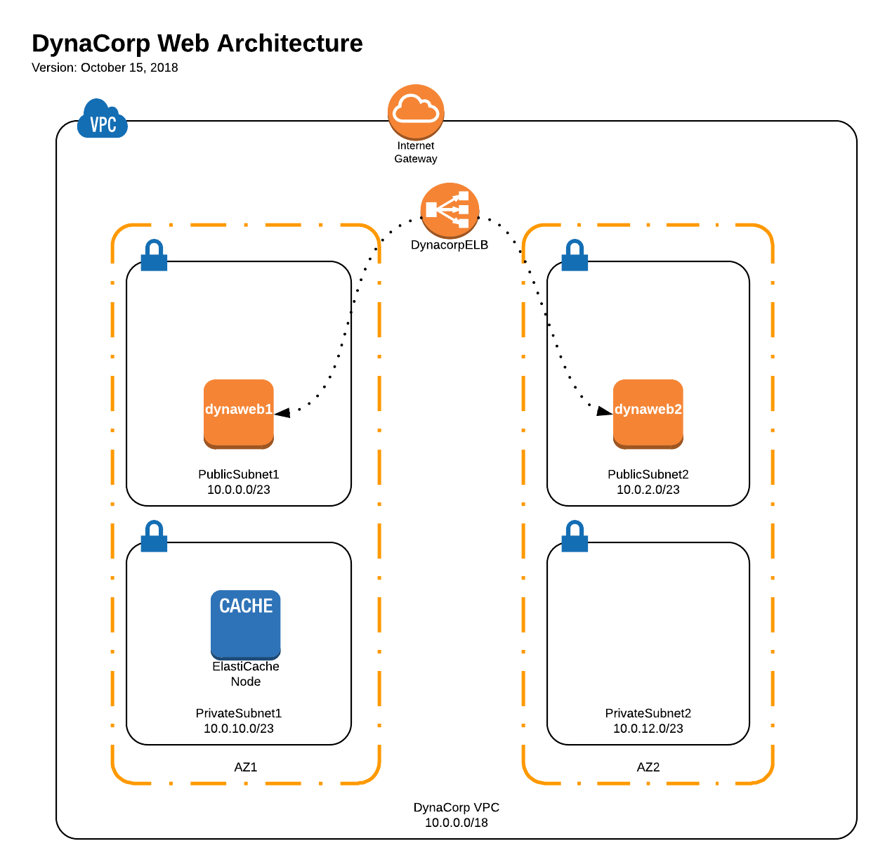
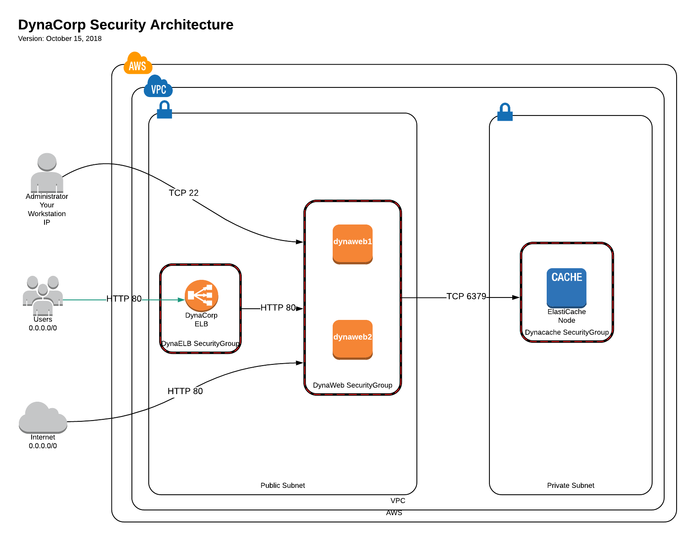
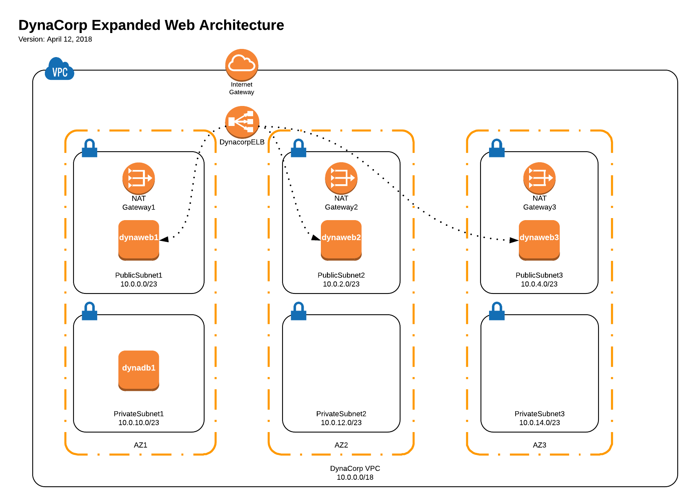
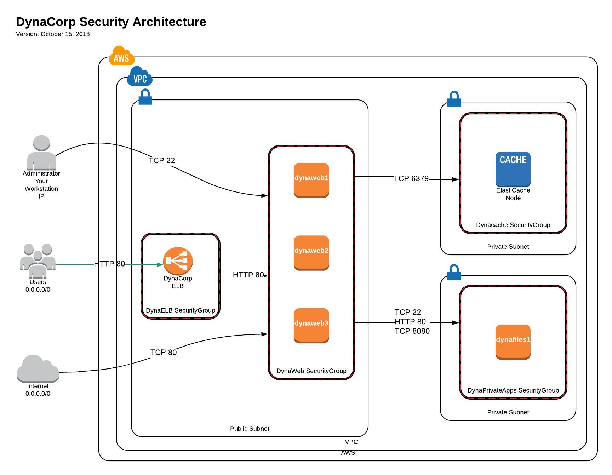

:blank: pass:[ +]

= SEIS 665 Midterm Challenge: DynaCorp
:icons: font
Jason Baker <bake2352@stthomas.edu>
1.2, 03/13/2018

:sectnums!:

== Overview

Your good friend Jerome works at DynaCorp Industries and he is responsible for deploying a
new web application on AWS. He created a number of AWS infrastructure resources to support the 
new web application (written in Node.js), but the web service
doesn't seem to be working. He texted you because he knows you have some experience
working with cloud computing and you might be able to help. He thinks that some of the AWS
resources aren't configured correctly and that some resources may be missing. Help Jerome figure
out how to get DynaCorp's web application working properly.

[IMPORTANT]
====
While this challenge is open book and you are free to use Internet resources to help you solve 
problems, the work you submit must be your own. The use of e-mail, Slack, text messaging, cell 
phones, or any tool that allows you to communicate with others while working on this challenge 
is considered cheating and will result in your immediate dismissal from this course. Accessing 
these tools during the challenge, even if accidental, is considered use. I strongly recommend 
that you log out, close, or terminate any communications applications running on your system.
====

[IMPORTANT]
====
You should not have any EC2 instances, ELBs, NAT gateways or Target Groups configured in us-east-2 
before working on this challenge. Delete these resources immediately before proceeding. 
====

[IMPORTANT]
====
If you are able to get the DynaCorp website running, that does not necessarily mean 
that all the resources in the desired architecture are configured properly! 
====

[NOTE]
====
Do not print this document, it is disruptive to the rest of the students participating in the 
class. I also may make changes to this web document during the challenge to correct errors or 
omissions.
====

[NOTE]
====
You must submit your work in a Github repository to receive credit for this challenge. E-mail 
messages, screenshots,
and verbal explanations will not be accepted or graded. Please budget time to complete your 
final work submission. 
====

:sectnums:
==  Launch the application stack

Jerome created a CloudFormation template which can be used to deploy the DynaCorp
application infrastructure on AWS. We haven't used CloudFormation much yet but we will
work with it a lot in the second half of the semester. The infrastructure resources will be
launched into the us-east-2 (Ohio) region. Before you launch the template, make sure you have setup an
EC2 key pair in this region. Remember, your keys from the us-east-1 region will not work in
any other region! You can create a new set of keys using the EC2 web console.

Jerome provided you with the following
link you can click on to launch the CloudFormation template in the us-east-2 region:

https://console.aws.amazon.com/cloudformation/home?region=us-east-2#/stacks/new?stackName=dynacorp&templateURL=https://s3.amazonaws.com/seis665/dynacorp-cf-broken.json[Launch stack]

The template will create a stack containing a number of AWS resources:

* An AWS Virtual Private Cloud (VPC) including subnets, routing tables, routes, an Internet gateway, and security groups.

* An ElastiCache node running the Redis caching engine.

* An Application ELB for distributing requests to the DynaCorp webservers.

After clicking on the launch link, click the *Next* link:

On the stack *Specify Details* page, enter the following:

1. In *Stack name*, the value should be `dynacorp`.
2. In *YourIp*, type in your current workstation public IP address in CIDR notation (use http://checkip.amazonaws.com to find it).

Click the *Next* button.

On the *Options* page just click *Next*.

On the *Review* page, review the settings and click the checkbox next to the
statement *I acknowledge that AWS CloudFormation might create IAM resources.* Finally, click 
the *Create* link.

It will take 5-10 minutes for CloudFormation to create the AWS resources for you. You can watch 
the progress messages on the *Events* tab in the console. When the stack has been created, you 
will see a CREATE_COMPLETE message in the *Status* column of the console and on the *Overview* 
tab.

== Service architecture

Jerome was kind enough to provide you with two architectural diagrams he created during
an engineering planning session. The first diagram shows how the resources should be configured. The CloudFormation template he provided  creates some of the resources described in the diagram.

The second diagram shows all of the security groups, their relationships, and which incoming 
services are allowed by the groups. Security is important to DynaCorp and Jermone spent a lot of time
creating a robust security architecture.

== Troubleshoot the platform

Jerome mentioned to you that the DynaCorp web service doesn't work after launching the CloudFormation template because it's missing the webservers (and maybe other things). He  recommended that you create the webservers before performing any troubleshooting. The webservers should have the following settings:

* t2.micro type
* ami-babc8adf AMI
* Dynacorp-Service-Report IAM role

You will need to enter a small shell script in the EC2 instance user data when launching the webservers, replacing the `<redis_endpoint>` value with the Redis service fully-qualified domain name endpoint and the `<server_name>` value with the name of the webserver instance:

  #!/bin/bash -xe
  docker swarm init
  docker service create \
  --name webapp \
  -p 80:8080 \
  -e 'REDIS_HOST=<redis_endpoint>' \
  -e 'SERVER_NAME=<server_name>' dynaweb:latest

Once the webservers are running, you should begin to test the Dynacorp website. Jerome isn't sure why the site doesn't come up when he accesses the ELB endpoint on port 80. Jerome setup a special ELB health check endpoint on each web server listening on port 80 (http) at the URL path `/health`. 

He is able to access the web servers via ssh, and he can access the websites running on each web server directly. The websites display an error message though -- something about not being able to connect to a Redis database. Jerome setup an ElastiCache node listening on the standard Redis port 6379, but for some reason the web applications are not able to access the Redis database. 

Help your friend troubleshoot and fix the DynaCorp web platform! You may need to update or add resources to fix the platform. However, do not remove any resources created by the CloudFormation template.

One more thing, Jerome mentioned that the EC2 instances are running Ubuntu Linux, and if you need to shell into any
of them you should use the `ubuntu` user account instead of `ec2-user`.

== Expand the platform

Your friend Jermome just called! DynaCorp would like to add another webserver to the server cluster because
their product manager expects greater than anticipated demand for the new website. Add a third web server called
`dynaweb3` located in a new availability zone (different than the other 2 AZs). Each web server should live in a 
separate AZ. The new web server configuration should closely match the existing web servers (similar instance 
type, AMI, role, etc). Obviously the instance will have a different name tag.

He asked you to expand the number of private networks and add a NAT gateway in the new AZ. Also, he would like you to add a private server to the new AZ called `dynafiles1` which is able to access the Internet. It should have the following settings:

* t2.micro type
* ami-babc8adf AMI
* Dynacorp-Service-Report IAM role
* New Security group called `dynacorp-Dynaprivate-apps` which allows:
  ** Incoming access from the `dynacorp-DynaWebSecurityGroup` on ports 80 and 8080

Jerome e-mailed you the following diagrams which show the updated architecture he created for DynaCorp.

== Run a shell script

Once you have corrected the issues with the DynaCorp web application and have successfully tested the third webserver and private server, run a shell script to document your work. Jerome needs this documentation to ensure you get paid for your labor.

Create a shell script called `aws-report.sh` in a directory located at `~/report` on any one of the instances. The script
should generate a set of JSON files containing the output of AWS CLI commands. These files contain information describing your AWS VPC. If you run this script and then change the configuration of a resource in the VPC, you will need to run this script again to capture the changes. 

Here are the commands you should use in the shell script. Note, you should _not_ run these commands as the
root user.

  REGION=us-east-2
  aws elbv2 describe-load-balancers  --region $REGION > elbs.json
  ELBARN=$(aws elbv2 describe-load-balancers  --region $REGION | jq -r '.LoadBalancers[0] .LoadBalancerArn')
  aws ec2 describe-instances  --region $REGION > instances.json
  aws elbv2 describe-listeners --load-balancer-arn $ELBARN  --region $REGION > listeners.json
  aws ec2 describe-nat-gateways  --region $REGION > nats.json
  aws ec2 describe-route-tables  --region $REGION > routes.json
  aws ec2 describe-subnets  --region $REGION > subnets.json
  aws elbv2 describe-target-groups  --region $REGION > targetgroups.json
  TGARN=$(aws elbv2 describe-target-groups  --region $REGION | jq -r '.TargetGroups[0] .TargetGroupArn')
  aws elbv2 describe-target-health --target-group-arn $TGARN  --region $REGION > targethealth.json
  aws ec2 describe-security-groups  --region $REGION > security-groups.json
  aws ec2 describe-vpcs  --region $REGION > vpcs.json

=== Check your work
Here is what the contents of your git repository should look like before final submission:

====
&#x2523; aws-report.sh +
&#x2523; elbs.json +
&#x2523; instances.json +
&#x2523; listeners.json +
&#x2523; nats.json +
&#x2523; routes.json +
&#x2523; subnets.json +
&#x2523; targetgroups.json +
&#x2523; targethealth.json +
&#x2523; security-groups.json +
&#x2517; vpcs.json +
====

=== Submit your work

Check each of the files to make sure the files contain data and the filesnames are correct. Add all of the
files to a local Git repository and commit your work.

Finally, create a new GitHub Classroom repository by clicking on this link:

https://classroom.github.com/a/mHqwK_Sf

Associate your local repository with this new GitHub repo and push the local master branch from your repository 
up to GitHub. Verify that your files are properly stored on GitHub. Remember, you must submit your work using 
GitHub
to receive any credit on this challenge.

=== Terminate stack

The last step in the challenge is to delete all the AWS resources you created so that you don't use up all your 
free AWS credits. Before you can delete the CloudFormation stack you created at the beginning of the challenge, 
you need to manually delete the EC2 instances and NAT gateway you created. If you try to delete the CloudFormation stack without manually deleting these resources the stack will fail to delete properly (you will learn why this is the case in a few weeks).

After deleting the new resources manually, go to the CloudFormation web
console and select the DynaCorp stack. Click on the `Actions` button above and select the
`Delete Stack` action from the drop-down menu. Remember, you will
get billed for each hour these services are running (or at least lose free
credits). Note, because you manually made changes to the resource in this stack it may not delete properly
the first time. If you encounter a deletion error simply select the stack again and retry the delete action.

== Submitting your work
You must submit your work via GitHub. I will not accept an email, pictures, or printed materials.  
