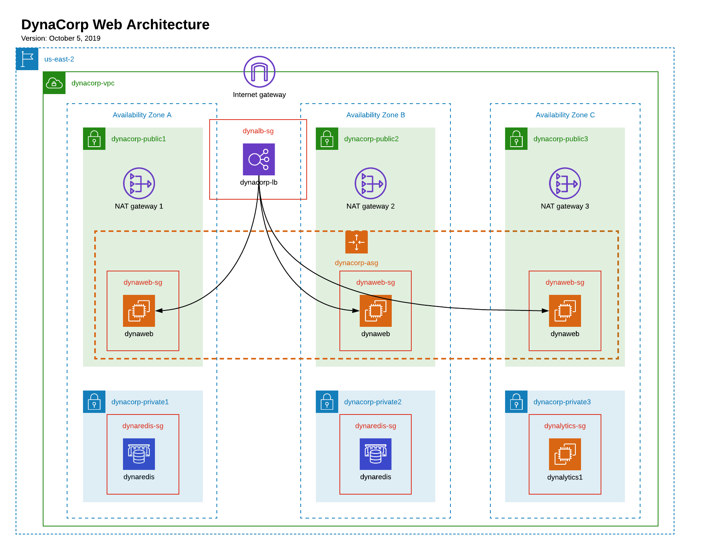
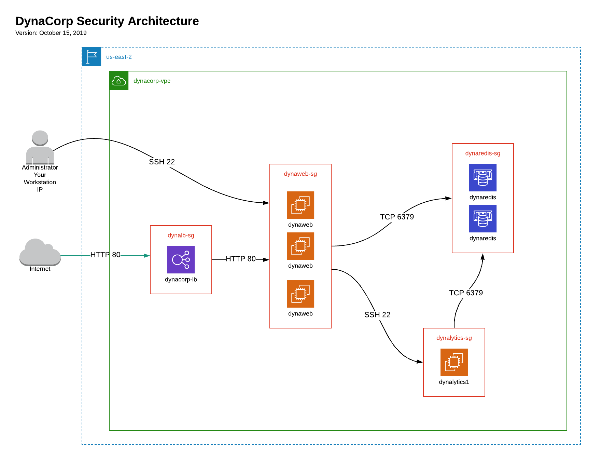

:blank: pass:[ +]

= SEIS 665 Midterm Challenge: DynaCorp
:icons: font
Jason Baker <bake2352@stthomas.edu>
1.3, 10/20/2019

:sectnums!:

== Overview

Your good friend Jerome works at DynaCorp Industries as an enterprise architect and he is responsible for deploying a new web application on AWS. He created a couple AWS infrastructure diagrams to decribe the resources necessary to support the web application. He texted you because he knows you have some experience working with AWS and you might be able to help him setup the application environment. Help Jerome figure out how to get DynaCorp's web application deployed.

[IMPORTANT]
====
While this challenge is open book and you are free to use Internet resources to help you solve 
problems, the work you submit must be your own. The use of e-mail, Slack, text messaging, cell 
phones, or any tool that allows you to communicate with others while working on this challenge 
is considered cheating and will result in your immediate dismissal from this course. Accessing 
these tools during the challenge, even if accidental, is considered use. I strongly recommend 
that you log out, close, or terminate any communications applications running on your system.
====

[IMPORTANT]
====
You should not have any EC2 instances, ELBs, NAT gateways or Target Groups configured in us-east-2 (Ohio) 
before working on this challenge. Delete these resources immediately before proceeding. 
====

[NOTE]
====
Do not print this document, it is disruptive to the rest of the students participating in the 
class. I also may make changes to this web document during the challenge to correct errors or 
omissions.
====

[NOTE]
====
You must submit your work in a Github repository to receive credit for this challenge. E-mail 
messages, screenshots, and verbal explanations will not be accepted or graded. Please budget time to complete your final work submission. 
====

:sectnums:
== Service architecture

Jerome was kind enough to provide you with two architectural diagrams he created during
an engineering planning session. The first diagram shows how the resources should be configured.

DynaCorp's new web application environment consists of a VPC (`dynacorp-vpc`) located in us-east-2 (Ohio) using a 10.50.0.0/20 CIDR block. The VPC is partitioned into 3 public subnets and 3 private subnets located in separate AZs. The three public subnets are:

  * dynacorp-public-1 (10.50.1.0/24)
  * dynacorp-public-2 (10.50.2.0/24)
  * dynacorp-public-3 (10.50.3.0/24)

The three private subnets are:

  * dynacorp-private-1 (10.50.11.0/24)
  * dynacorp-private-2 (10.50.12.0/24)
  * dynacorp-private-3 (10.50.13.0/24)

Each AZ has a NAT gatway with the appropriate routing configuration in place.

The DynaCorp web application consists of a Node.js application running on mutiple webservers in an auto-scaling group. Website requests are distributed to the webservers using an application load balancer. The web application persists data on a Redis database cluster.

DynaCorp would like to run a special analytics application on a private EC2 instance (`dynalytics1`) which retrieves data from Redis.

The second diagram shows all of the security groups, their relationships, and the ingress security rules. Security is important to DynaCorp and Jermone spent a lot of time creating a robust security architecture.

Internet users are able to access the application load balancer (`dynalb-sg`) using HTTP on port 80. The application load balancer is able to access the webservers (`dynaweb-sg`) using HTTP on port 80. The webservers are able to access the Redis cluster (`dynaredis-sg`) using TCP on port 6379. 

The platform administrator (your workstation IP) is able to use SSH to access the webservers. The webservers are able to access the `dynalytics1` instance (`dynalytics-sg`) using SSH. Finally, the dynalytics1 instance is able to access the Redis database cluster using TCP on port 6379.

== Deploying the web application

The DynaCorp web application consists of a Node.js application which persists data in a Redis database. Start by creating a Redis database cluster containing 2 nodes in separate AZs running Redis v5.0.5 on cache.t2.micro instances.  These cluster nodes are associated with the `dynaredis-sg` security group.

The web application is hosted on 3 EC2 instances which are part of an auto-scaling group (`dynacorp-asg`). The instances are associated with the `dynaweb-sg` security group. Each instance has the following properties:

* t2.micro type
* ami-046fad5d3dc51acb2 AMI
* public IP address enabled

You will need to enter a small shell script in the EC2 instance user data when launching the webservers, replacing the `<redis_endpoint>` value in the script code with the Redis fully-qualified domain name endpoint (*this address shouldn't include a port number and is usually called a Configuration Endpoint*):

  #!/bin/bash -xe
  HOSTNAME=$(curl http://169.254.169.254/latest/meta-data/local-hostname)
  docker service create \
  --name webapp \
  -p 80:8080 \
  -e 'REDIS_HOST=<redis_endpoint>' \
  -e "SERVER_NAME=$HOSTNAME" dynaweb:latest

Create an application load balancer to distribute requests to the webservers. The load balancer should use the `/health` endpoint address for health checks.

The EC2 instances are running Ubuntu Linux, and if you need to shell into any
of them you should use the `ubuntu` user account instead of `ec2-user`. Note, you should not need to install, update, or restart any services on the webservers if the servers were properly launched. If you haven't created any EC2 instances in the us-east-2 region before, you will need to create a new EC2 keypair since keypairs are region specific.

How will you know if the web application is working properly? You should be able to test the access to it from a web browser on your workstation. If you see an error message, that means something is likely misconfigured. If you see a lovely webpage with a page hit counter on it, congratulations you got it working! Refresh the webpage a number of times until the page counter displays at least 10 views. 

Make sure that all of your webservers are responding to website requests. You can view which webserver is handling the request by looking at the bottom of the web page.

== Capture some data

Jerome would like you to collect some data from a server in the new web platform. Launch a new EC2 instance called `dynalytics1` in the private subnet of the third AZ. This instance is associated with the `dynalytics-sg` security group. 

Create an instance IAM Role called `EC2ReadOnly` with the AmazonEC2ReadOnlyAccess policy attached to it. Alternatively you could install a set of user API keys on the server if you cannot figure out how to setup the proper instance role, however this will result in a score reduction.

The instance has the following properties:

* t2.micro type
* ami-046fad5d3dc51acb2 AMI
* public IP address disabled
* IAM role: EC2ReadOnly

After logging into the server, run the following command:

  aws ec2 describe-instances --instance-ids $(curl http://169.254.169.254/latest/meta-data/instance-id) --region us-east-2 > analytics.json

The command will create an output file called `analytics.json`. You will need to provide this file at the end of the challenge so don't delete this instance.

Note, you can skip this part of the challenge completely but it will cost you some points.

== Run a shell script

Log into one of the webservers and run a shell script to document your work on this challenge. 

Create a shell script called `aws-report.sh` in a directory located at `~/report` on any one of the dynaweb instances. The script
should generate a set of JSON files containing the output of AWS CLI commands. These files contain information describing your AWS VPC. If you run this script and then change the configuration of a resource in the VPC, you will need to run this script again to capture the changes. 

Here are the commands you should use in the shell script. Note, you should _not_ run these commands as the
root user. Additionally, the instance needs to have AWS API credentials in order to run the commands in the script. You can either replace the IAM role on the EC2 instance with the role you created in the previous section (`EC2ReadOnly`) or you can run the `aws configure` command and provide a set of API access keys.  

Here are the commands which you should place in the shell script:

  REGION=us-east-2
  aws autoscaling describe-auto-scaling-groups --region $REGION > autoscaling.json
  aws elbv2 describe-load-balancers --region $REGION > elbs.json
  ELBARN=$(aws elbv2 describe-load-balancers --region $REGION | jq -r '.LoadBalancers[0] .LoadBalancerArn')
  aws ec2 describe-instances --region $REGION > instances.json
  aws autoscaling describe-launch-configurations --region $REGION > launch-configurations.json
  aws elbv2 describe-listeners --load-balancer-arn $ELBARN --region $REGION > listeners.json
  aws ec2 describe-nat-gateways --region $REGION > nats.json
  aws ec2 describe-route-tables --region $REGION > routes.json
  aws ec2 describe-subnets --region $REGION > subnets.json
  aws elbv2 describe-target-groups --region $REGION > targetgroups.json
  TGARN=$(aws elbv2 describe-target-groups --region $REGION | jq -r '.TargetGroups[0] .TargetGroupArn')
  aws elbv2 describe-target-health --target-group-arn $TGARN --region $REGION > targethealth.json
  aws ec2 describe-security-groups --region $REGION > security-groups.json
  aws ec2 describe-vpcs --region $REGION > vpcs.json
  curl -s $(cat elbs.json | jq -r .[][0].DNSName) > response.html

=== Check your work
Here is what the contents of your git repository should look like before final submission:

====
&#x2523; analytics.json +
&#x2523; autoscaling.json +
&#x2523; aws-report.sh +
&#x2523; elbs.json +
&#x2523; instances.json +
&#x2523; launch-configurations.json +
&#x2523; listeners.json +
&#x2523; nats.json +
&#x2523; routes.json +
&#x2523; subnets.json +
&#x2523; targetgroups.json +
&#x2523; targethealth.json +
&#x2523; response.html +
&#x2523; security-groups.json +
&#x2517; vpcs.json +
====

=== Submit your work

Check each of the files to *make sure the files contain data* and the filenames are correct. Add all of the
files to a local Git repository and commit your work. Note, if you skipped the _Capture some data_ section your repository will not have an `analytics.json` file.

Finally, create a new GitHub Classroom repository by clicking on this link:

https://classroom.github.com/a/mHqwK_Sf

Associate your local repository with this new GitHub repo and push the local master branch from your repository 
up to GitHub. Verify that your files are properly stored on GitHub. Remember, you must submit your work using 
GitHub
to receive any credit on this challenge.

=== Delete all AWS resources

The last step in the challenge is to delete all the AWS resources you created so that you don't use up all your 
free AWS credits. 

== Submitting your work
You must submit your work via GitHub. I will not accept an email, pictures, or printed materials.  
